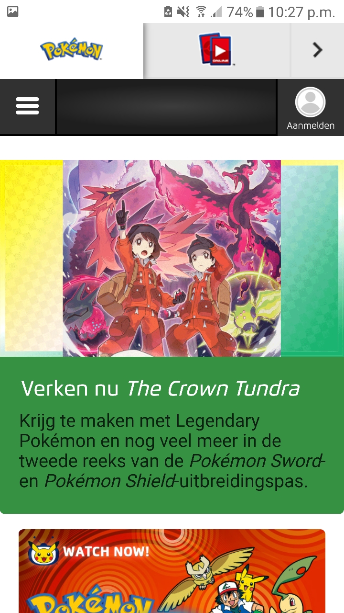

# Procesverslag
**Auteur:** Quincy Kasto

Markdown cheat cheet: [Hulp bij het schrijven van Markdown](https://github.com/adam-p/markdown-here/wiki/Markdown-Cheatsheet). 
Nb. de standaardstructuur en de spartaanse opmaak zijn helemaal prima. Het gaat om de inhoud van je procesverslag. Besteedt de tijd voor pracht en praal aan je website.

## Bronnenlijst
1. https://flexbox.help/
2. w3schools.com
3. stackoverflow.com
4. https://developer.mozilla.org
5. https://css-tricks.com/
6. gegeven theorie van het vak
7. opdrachten van het vak
8. gekregen tips van de voortgangsgesprekken

## Eindgesprek (week 7/8)

-dit ging goed & dit was lastig-

ik weet niet zeker of mijn microinteractie voldoende is.
nogal wat twijfels over of de gehele verzorging zowel visueel op de website (en dan ook op alle niveaus van responsiveness als de code zelf wel helemaal goed is.

**Screenshot(s):**

## Voortgang 3 (week 6)

Niet veel verandering/voortgang in vergelijking tot gesprek 2.
Gehele voortgang is getoond aan de studentassistent (hij had de website nog alleen t/m voortgang 1 gezien).
Daarom gevraagd om tips van wat er beter/toegevoegd kon worden.
tip gekregen om ook een "scroll-to-top"button toe te voegen als extra javascript onderdeel.

## Voortgang 2 (week 5)

vragen die ik had heb ik hier gesteld gesteld.
goede hoeveelheid content.
slider hoeft niet helemaal mooi werkend te zijn (teveel onnodige moeite).
Microinteractie mist nog (denk na over wat dat voor mijn website zou kunnen worden).
handige tip over positionering in het midden gekregen.

## Voortgang 1 (week 3)

vragen die ik had heb ik hier gesteld.
goede hoeveelheid content.
zitten hier en daar nog wat onderdelen die "fixing" nodig hebben
classes moeten nog weggewerkt worden
sommige onderdelen kunnen beter een flexbox of grid gebruiken i.p.v. te spelen met posities.
tips over hoe de carrousel kan laten werken gekregen.

-dit ging goed & dit was lastig-
onderdelen op de juiste plek (en mooi) krijgen
het carrousel
vormgeving (kleur en vorm van sommige onderdelen)

**Screenshot(s):**

-screenshot(s) van hoe ver je bent met korte uitleg-

### Agenda voor meeting

-samen met je groepje opstellen-

| student 1      | student 2          | student 3    | student 4        |
| ---            | ---                | ---          | ---              |
| dit bespreken  | en dit             | en ik dit    | en dan ik dat    |
| an dat ook nog | dit als er tijd is | nog een punt | dit wil ik zeker |
| ...            | ...                | ...          | ...              |

### Verslag van meeting

-na afloop snel uitkomsten vastleggen-

## Breakdownschets (week 1)

## Intake (week 1)
-uitwerken voor de kick-off werkgroep - begin van de eerste week-

**Je startniveau:** -kies uit zwart, rood óf blauw- 
Blauw. Ik heb vorig jaar namelijk inleiding programmeren niet gehaald.
javascript is dus nog niet helemaal duidelijk voor me.
ik ben ook niet zeker over mijn niveau voor HTML & Css 

**Je focus:** -kies uit responsive óf surface plane- 
responsive

**Je opdracht:** -link naar de website die je gaat namaken óf de naam van je eigen ontwerp- 
pokemon.com/nl

**Screenshot(s) van de eerste pagina (small screen):**

